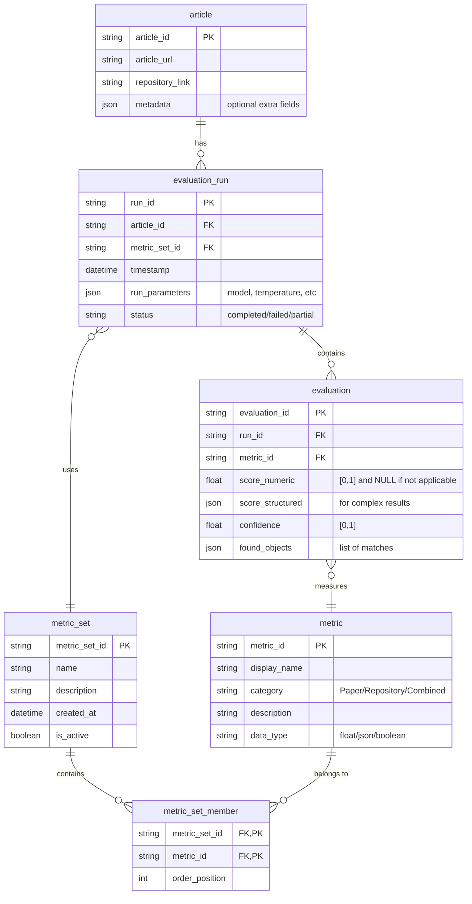

# Architecture

## Data model

```mermaid
erDiagram
    direction TB
    article {
        string article_id PK
        string article_url
        string repository_link
        json metadata "optional extra fields"
    }
    
    metric {
        string metric_id PK
        string display_name
        string category "Paper/Repository/Combined"
        string description
        string data_type "float/json/boolean"
    }
    
    metric_set {
        string metric_set_id PK
        string name
        string description
        datetime created_at
        boolean is_active
    }
    
    metric_set_member {
        string metric_set_id FK,PK
        string metric_id FK,PK
        int order_position
    }
    
    evaluation_run {
        string run_id PK
        string article_id FK
        string metric_set_id FK
        datetime timestamp
        json run_parameters "model, temperature, etc"
        string status "completed/failed/partial"
    }
    
    evaluation {
        string evaluation_id PK
        string run_id FK
        string metric_id FK
        float score_numeric "[0,1] and NULL if not applicable"
        json score_structured "for complex results"
        float confidence "[0,1]"
        json found_objects "list of matches"
    }

    article ||--o{ evaluation_run : "has"
    evaluation_run ||--o{ evaluation : "contains"
    evaluation }o--|| metric : "measures"
    metric_set ||--o{ metric_set_member : "contains"
    metric ||--o{ metric_set_member : "belongs to"
    evaluation_run }o--|| metric_set : "uses"
```